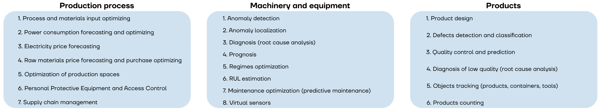

[](https://doi.org/10.5281/zenodo.8106433)

# Information about AI/DS/ML in Industrial Applications
An overview of cases, public datasets, books and academic papers related to applying ML in industrial applications

## Repository structure
There are various useful lists:
- [Cases](cases.md)
- [Datasets](datasets.md)
- [Books & Academic Papers](papers.md)

## Sectors
Repository includes following industrial sectors:  
- metallurgy 
- oil&gas 
- chemical 
- mechanical 
- energetics 
- other sectors 

## Business problems


Lists are classified by the following common problems:
- ***Production process***: Recommendations, process control, and safety
- ***Machinery and equipment***: Maintenance management, Anomaly detection and process monitoring (faults/failures/deviations), RUL (remaining usefull life) and TTF (time-to-failure)
- ***Products***: Product design, quality control, counting and tracking
- ***Others***

# Citation
Please cite my project in your publications if it helps your research.
```
Katser Iurii. (2023, July 2). AI/DS/ML in Industrial Applications. Zenodo. https://doi.org/10.5281/zenodo.8106433
```
Or in BibTeX format:
```
@misc{katser_iurii_2023_8106433,
  author       = {Katser Iurii},
  title        = {AI/DS/ML in Industrial Applications},
  month        = jul,
  year         = 2023,
  note         = {https://github.com/YKatser/Industrial-ML},
  publisher    = {Zenodo},
  version      = {v1.0},
  doi          = {10.5281/zenodo.8106433},
  url          = {https://doi.org/10.5281/zenodo.8106433}
}
```